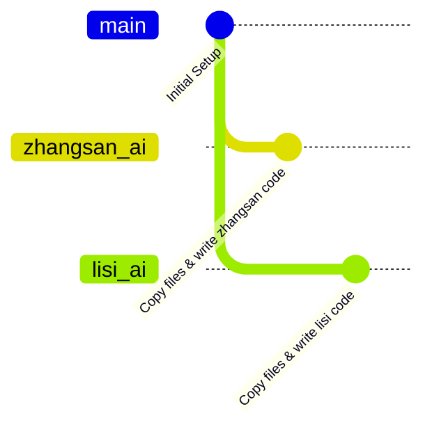
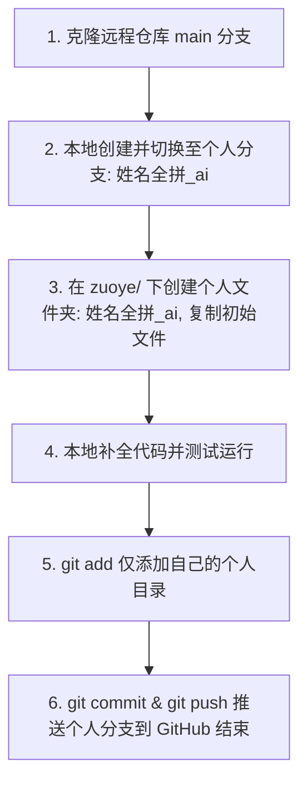

# 🚀 ZJSZJD_502_AI - 502班AI协作作业仓库

本仓库主要用于管理与提交 502 班 AI 课程的每日作业。通过 Git 独立开发分支，大家可以在不产生任何冲突的前提下，独立完成并提交自己的作业代码。

---

## 🛠️ 作业提交规范与 Git 分支协作流程

本仓库采用 **“独立开发分支 + 独立运行目录”** 的协作模式。

### 📌 协作核心规则
1. **Git 分支命名**：统一使用**姓名全拼全小写_ai**（例如：张三的分支命名为 `zhangsan_ai`）。
2. **作业目录结构**：在根目录 `zuoye/` 文件夹下创建与自己分支同名的文件夹：`zuoye/姓名全拼_ai/`（例如：`zuoye/zhangsan_ai/`）。
3. **隔离提交流程**：在本地创建个人分支 -> 复制 `zuoye` 目录下的初始文件到自己专属的命名文件夹中 -> 编写并运行测试 -> 提交并直接推送个人分支到 GitHub 即可（无需在网页端创建 Pull Request 合并请求）。

### 📊 Git 协作流程图 (Mermaid)



具体的操作步骤，对应的分支协作生命周期如下：



---

### 💻 详细 Git 实操命令

#### 步骤 1：克隆仓库到本地目录
```bash
git clone https://github.com/haozhiping/ZJSZJD_502_AI.git
cd ZJSZJD_502_AI
```

#### 步骤 2：创建并切换到个人独立分支
```bash
# 示例：张三同学的分支创建命令
git checkout -b zhangsan_ai
```

#### 步骤 3：提交与推送个人分支
作业编写并测试无误后，返回仓库根目录，将你的分支推送至 GitHub 远程仓库：
```bash
# 1. 检查修改文件，确保只修改了自己目录下的文件
git status

# 2. 仅添加你的专属目录
git add zuoye/zhangsan_ai/

# 3. 提交至本地仓库
git commit -m "feat: submit daily homework for zhangsan"

# 4. 推送独立分支到 GitHub 远程仓库（作业在此处已完成提交）
git push -u origin zhangsan_ai
```
